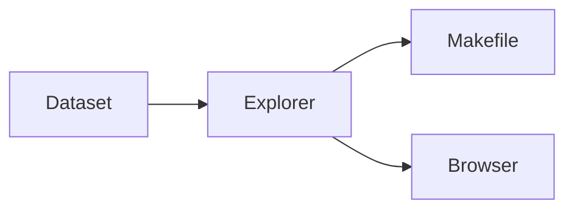

# Ethereum Block Explorer

Privately analyze compatible Ethereum CSV exports in your browser, or explore the bundled 100-block sample. The browser UI, JSON CLI, and static build require no backend.



## Get started

```bash
make dashboard   # summary in the terminal
make ui          # http://localhost:4173
make verify      # same gate as CI
```

```bash
make block N=15049311
make address ADDR=0x58a5b1a1c67e984247a0c78f2875b0f9c781b64f
make report      # writes ethereum-report.md
```

## Supported Commands

| Command | Output |
| :-- | :-- |
| `make help` | Command guide and runtime requirements |
| `make dashboard` | Human-readable dataset summary |
| `make ui` | Static browser explorer |
| `make block N=15049311` | Block JSON |
| `make address ADDR=0x...` | Address profile JSON |
| `make network` | Network analysis JSON |
| `make report` | Writes ethereum-report.md |
| `make run` | Interactive menu |
| `make brief` | Action brief |
| `make snapshot` | Compact JSON context packet |
| `make anomalies THRESHOLD=1.5` | Anomaly analysis JSON |
| `make miners` | Unique miner breakdown JSON |
| `make run-json` | JSON overview |
| `make verify` | JUnit + CLI + browser smoke |
| `make test` | JUnit suite |
| `make cli-smoke` | Core explorer command smoke test |
| `make ui-build` | Prepare static web files |
| `make ui-contract` | Browser CSV import/domain contract tests |
| `make ui-smoke` | Browser explorer smoke test |
| `make build` | Compile explorer |
| `make clean` | Remove compiled artifacts |
| `make ui-clean` | Remove generated web preview files |

Dataset files live in the repo root: `ethereumP1data.csv`, `ethereumtransactions1.csv`.

## Load your data

Run `make ui`, open the explorer, select **Load your CSVs**, and choose both exports. Each file can be up to 25 MiB. Parsing, validation, and indexing happen in a browser worker; the files are never uploaded.

The import boundary uses these positional schemas:

- Blocks CSV: block number at column 1 (`[0]`), miner address at column 10 (`[9]`), Unix timestamp at column 17 (`[16]`), and transaction count at column 18 (`[17]`).
- Transactions CSV: block number at column 4 (`[3]`), transaction index at column 5 (`[4]`), sender at column 6 (`[5]`), recipient at column 7 (`[6]`, blank for contract creation), gas limit at column 9 (`[8]`), and gas price at column 10 (`[9]`).

Imports reject malformed rows and duplicate block numbers. Parsing stops at 64 columns, 25,000 block rows, or 100,000 transaction rows with an actionable error. Gas values must resolve to non-negative base-10 integers; the import bounds are 1,000,000,000 gas and 1,000,000,000,000,000 wei per gas. Transactions outside the imported block range are excluded from analysis. Use the bundled CSV links in the import dialog as schema examples.

Large views stay bounded: the timeline renders at most 400 cells, each spark chart renders at most 240 sampled points, and transaction tables show 50 rows per page. All imported blocks and matching transactions remain indexed for search and navigation.

Port override: copy `.env.example` → `.env`, set `UI_PORT`.

Static deploy: `vercel.json` publishes `web/dist/`.

## Reference

Requires Python 3 (`make ui`), Java (CLI + tests), Node.js (browser build).

```bash
make test
make verify
```

MIT · [LICENSE](LICENSE)
