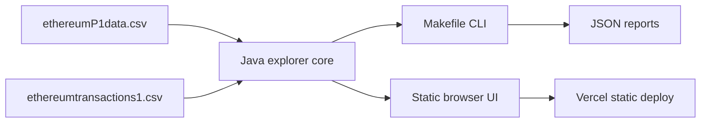

# Ethereum Block Explorer

Explore a bundled 100-block Ethereum sample dataset through a static browser UI, JSON CLI tools, and Makefile-driven workflows. No external node or API required.

## Data flow



## Start here

```bash
make help        # command reference
make dashboard   # fastest human-readable summary
make ui          # browser at http://localhost:4173
make verify      # full local health gate (same as CI)
```

Inspect entities:

```bash
make block N=15049311
make address ADDR=0x58a5b1a1c67e984247a0c78f2875b0f9c781b64f
make network
make report      # writes ethereum-report.md
make snapshot    # compact JSON context packet
```

## Command reference

| Command | Output |
| --- | --- |
| `make dashboard` | Terminal summary of the dataset |
| `make ui` | Static browser explorer |
| `make block N=…` | Single block JSON |
| `make address ADDR=…` | Address profile JSON |
| `make network` | Network analysis JSON |
| `make anomalies THRESHOLD=1.5` | Anomaly scan JSON |
| `make report` | Markdown report file |
| `make verify` | JUnit + CLI smoke + browser smoke |
| `make test` | JUnit suite (vendored runner) |

## Browser UI

```bash
make ui
```

Serves a static workspace for block lookup, address lookup, miner concentration, and cross-navigation. Override the port via `.env` (`UI_PORT`, see `.env.example`).

## Requirements

- Python 3 for `make ui`
- Java runtime + JDK for CLI commands and tests
- Node.js for browser build and smoke tests
- Dataset files in repo root: `ethereumP1data.csv`, `ethereumtransactions1.csv`

## Deployment

`vercel.json` runs `make ui-build` and publishes `web/dist/` as a static site.

## Verification

```bash
make verify
```

Runs the JUnit suite, core CLI smoke checks, and Playwright browser smoke against the built UI.

## License

MIT. See [LICENSE](LICENSE).
