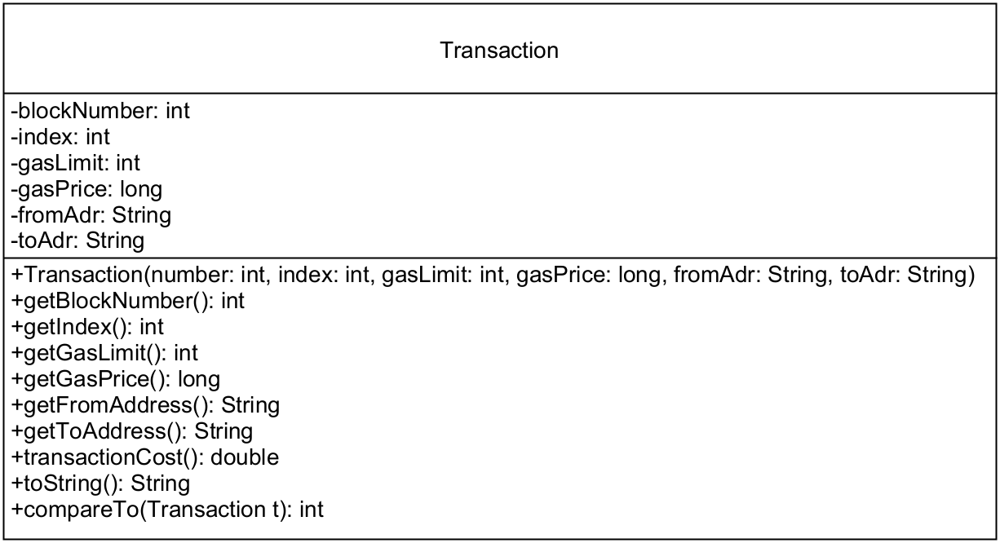
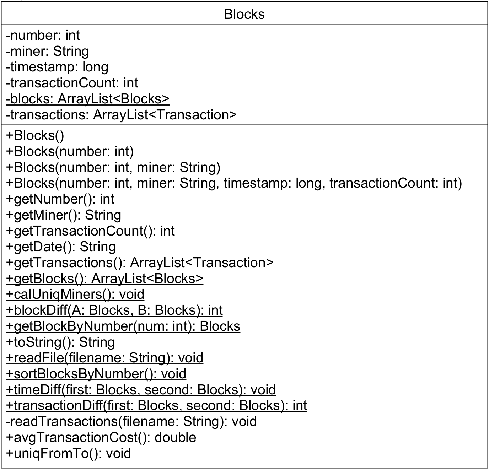
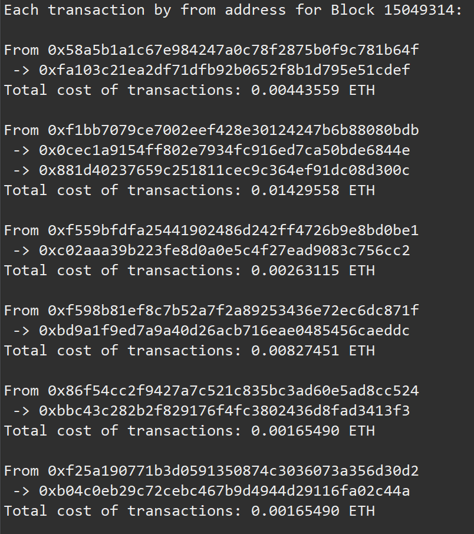

# Ethereum Block Explorer

Explore a 100-block Ethereum dataset from the terminal with fast block, address, dashboard, network, anomaly, and report workflows.

This repo expects a working Java runtime and JDK, plus the dataset files [`ethereumP1data.csv`](./ethereumP1data.csv) and [`ethereumtransactions1.csv`](./ethereumtransactions1.csv) in the repo root.

## Start Here

Discover the supported commands:

```bash
make help
```

Get value immediately:

```bash
make dashboard
```

Inspect one block:

```bash
make block N=15049311
```

Inspect one address:

```bash
make address ADDR=0x58a5b1a1c67e984247a0c78f2875b0f9c781b64f
```

Write a shareable markdown report:

```bash
make report
```

## Supported Commands

The supported entrypoint is the explorer CLI via `make` targets.

| Command | What it does |
| --- | --- |
| `make help` | Show the supported commands and runtime requirements |
| `make dashboard` | Print the fastest human-readable summary of the dataset |
| `make block N=15049311` | Return one block in JSON |
| `make address ADDR=0x...` | Return one address profile in JSON |
| `make brief` | Print the action brief |
| `make network` | Return network analysis in JSON |
| `make anomalies` | Return anomaly analysis in JSON |
| `make miners` | Return the unique miner breakdown in JSON |
| `make test` | Run the existing JUnit suite |
| `make report` | Write `ethereum-report.md` |
| `make run` | Open the interactive menu |
| `make run-json` | Print the JSON overview |
| `make clean` | Remove compiled explorer artifacts |

## Interactive Menu

The interactive menu is available, but it is a secondary surface:

```bash
make run
```

Use it when you want to browse from the terminal instead of calling a specific command.

## Repo Notes

- The default dataset contract is CSV-based: [`ethereumP1data.csv`](./ethereumP1data.csv) and [`ethereumtransactions1.csv`](./ethereumtransactions1.csv).
- [`src/Driver.java`](./src/Driver.java) is kept only as a legacy coursework demo. It is not part of the default build surface.
- Generated artifacts such as `.class` files and Javadoc output are not part of the supported product surface.

## Legacy Reference

This repo started as a coursework-style Ethereum blocks project. The material below is kept as reference, not as the primary way to approach the explorer.

<details>
<summary>Background and original class reference</summary>

A blockchain is a database of transactions that is updated and shared across many computers in a network. Every time a new set of transactions is added, it is called a block. This project uses a dataset of 100 Ethereum blocks plus a transaction dataset covering the first 15 blocks in that sample.

### Transaction UML



Key `Transaction` behaviors:

- `Transaction(int number, int index, int gasLimit, long gasPrice, String fromAdr, String toAdr)`
- `getBlockNumber()`, `getIndex()`, `getGasLimit()`, `getGasPrice()`
- `getFromAddress()`, `getToAddress()`
- `transactionCost()`
- `compareTo(Transaction t)`
- `toString()` returns `Transaction <index> for Block <blockNumber>`

### Blocks UML



Key `Blocks` behaviors:

- Constructors for empty, numbered, mined, and fully loaded blocks
- `getNumber()`, `getMiner()`, `getDate()`, `getTransactionCount()`, `getTransactions()`
- `calUniqMiners()`
- `getBlockByNumber(int num)`
- `blockDiff(Blocks a, Blocks b)`, `timeDiff(Blocks first, Blocks second)`, `transactionDiff(Blocks first, Blocks second)`
- `sortBlocksByNumber()`
- `readFile(String filename)` and transaction loading from [`ethereumtransactions1.csv`](./ethereumtransactions1.csv)
- `avgTransactionCost()`
- `uniqFromTo()`

`uniqFromTo()` sample output reference:

- Example image: 
- Full sample output: [`imgs/sampleoutput`](./imgs/sampleoutput)

</details>
