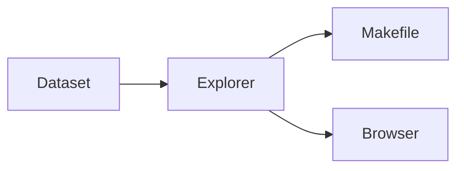

# Ethereum Block Explorer

A bundled 100-block Ethereum dataset. Browser UI, JSON CLI, no node required.



## Get started

```bash
make dashboard   # summary in the terminal
make ui          # http://localhost:4173
make verify      # same gate as CI
```

```bash
make block N=15049311
make address ADDR=0x58a5b1a1c67e984247a0c78f2875b0f9c781b64f
make report      # writes ethereum-report.md
```

## Overview

| Command | Output |
| :-- | :-- |
| `make dashboard` | Human-readable dataset summary |
| `make ui` | Static browser explorer |
| `make block N=…` | Block JSON |
| `make address ADDR=…` | Address profile JSON |
| `make network` | Network analysis JSON |
| `make snapshot` | Compact JSON context packet |
| `make verify` | JUnit + CLI + browser smoke |

Dataset files live in the repo root: `ethereumP1data.csv`, `ethereumtransactions1.csv`.

Port override: copy `.env.example` → `.env`, set `UI_PORT`.

Static deploy: `vercel.json` publishes `web/dist/`.

## Reference

Requires Python 3 (`make ui`), Java (CLI + tests), Node.js (browser build).

```bash
make test
make verify
```

MIT · [LICENSE](LICENSE)
